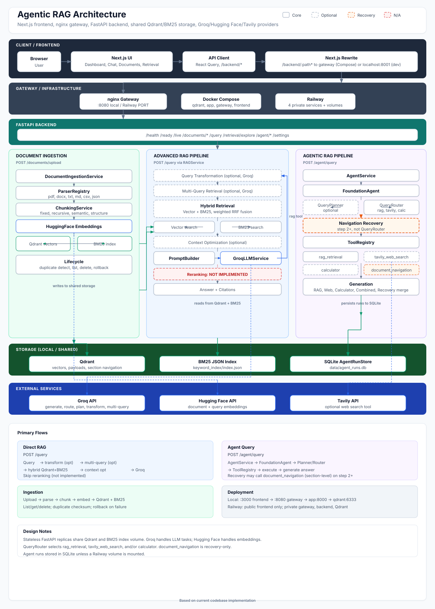

# Agentic RAG

Production-oriented retrieval-augmented generation platform with **Basic RAG**, **Advanced RAG**, and **Agentic RAG** layers, a Next.js dashboard, and Docker/Railway deployment support.

## Project Overview

Agentic RAG ingests documents (PDF, DOCX, plain text, Markdown, CSV, JSON), indexes them in Qdrant with an optional BM25 keyword index, and answers questions through:

1. **Direct RAG** (`POST /query`) — full retrieval pipeline with optional query rewriting, multi-query search, hybrid fusion, and context optimization.
2. **Agent orchestration** (`POST /agent/query`) — LLM routing/planning over registered tools (internal RAG, optional web search, calculator) with multi-step execution and document-navigation recovery.

```text
Basic RAG  →  Advanced RAG  →  Agentic RAG
 ingest        retrieve+rank      route+tools+recovery
 embed         optimize           multi-step agent
 generate      cite               generate+cite
```

## Key Features

### Basic RAG

- Multi-format document upload and parsing
- Configurable chunking (`fixed`, `recursive`, `semantic`, `structure`)
- Hugging Face embeddings stored in Qdrant
- Vector retrieval, grounded generation via Groq, structured citations
- Document list, metadata, delete, duplicate detection (SHA-256), rollback on partial failure

### Advanced RAG

- **Query transformation** — optional LLM query rewrite (`QUERY_TRANSFORMATION_ENABLED`)
- **Multi-query retrieval** — Groq-generated search variants merged and deduplicated (`MULTI_QUERY_ENABLED`)
- **Hybrid retrieval** — vector + BM25 with weighted reciprocal rank fusion (`HYBRID_SEARCH_ENABLED`)
- **Context optimization** — deduplication, score filtering, token budget (`CONTEXT_OPTIMIZATION_ENABLED`)
- **Retrieval explorer** — `POST /retrieval/explore` for pipeline inspection
- **Reranking** — **not implemented** (`reranking_enabled` is always `false`; no reranker service exists)

### Agentic RAG

- **Query routing** — Groq selects tools (`AGENT_ROUTING_ENABLED`)
- **Query planning** — hybrid queries decomposed into sub-tasks (`AGENT_PLANNING_ENABLED`)
- **Multi-step loop** — up to `AGENT_MAX_STEPS` (default `2`) decide → execute → generate
- **Tools:**
  - `rag_retrieval` — wraps the Advanced RAG retrieval pipeline
  - `tavily_web_search` — optional external web search (`WEB_SEARCH_ENABLED` + `TAVILY_API_KEY`)
  - `calculator` — safe arithmetic evaluation (`CALCULATOR_ENABLED`)
  - `document_navigation` — **recovery path only** (see below)
- **Navigation recovery** — after insufficient RAG answers, heuristics invoke `document_navigation` with section-level chunk loading; results merge with prior RAG context before regeneration
- **Agent run history** — SQLite store at `data/agent_runs.db` (`GET /agent/runs`)

> **Note:** `document_navigation` is registered in the tool registry but **not** selected by `QueryRouter`. It is invoked through the agent recovery path when enumeration or adjacent-section context is missing.

## Architecture

The canonical system diagram is **[docs/architecture.svg](docs/architecture.svg)** (embedded below). It reflects the current implementation only—dashed boxes are optional/config-gated, orange is the recovery path, and red marks features that are not implemented.



### System layers

| Layer | Components |
| --- | --- |
| **1. Client / Frontend** | Browser, Next.js UI, API client (React Query), `/backend` rewrite proxy |
| **2. Gateway / Infrastructure** | nginx gateway, Docker Compose, Railway (4 services) |
| **3. FastAPI backend** | HTTP routes, dependency injection, settings, health probes |
| **4. Document ingestion** | `DocumentIngestionService`, parsers, chunking, HF embeddings → Qdrant + BM25 |
| **5. Advanced RAG** | Query transform, multi-query, hybrid retrieval (vector + BM25 RRF), context optimization, Groq generation |
| **6. Agentic RAG** | `AgentService`, `FoundationAgent`, planner/router, recovery, `ToolRegistry`, generation |
| **7. Storage** | Qdrant, BM25 JSON index (`keyword_index_data` volume), SQLite agent runs |
| **8. External services** | Groq API, Hugging Face API, Tavily API (optional) |

### Runtime topology

```text
Browser → Next.js (:3000) → nginx gateway (:8080) → FastAPI (:8000) → Qdrant
                                              ↘ BM25 JSON index (shared volume)
                                              ↘ SQLite agent runs (local / Railway ephemeral)
```

Diagram legend: **Core** = always wired when enabled; **Optional** = config-gated; **Recovery** = `document_navigation` via heuristics (not QueryRouter); **N/A** = reranking (not implemented).

External providers: **Groq** (LLM routing, planning, generation, query transform, multi-query), **Hugging Face** (embeddings), **Tavily** (optional web search).

Railway service layout: [docs/railway-deployment.md](docs/railway-deployment.md).

### End-to-end flows

**Direct RAG** (`POST /query`):

```text
Query → [optional] query transformation → [optional] multi-query retrieval
     → hybrid retrieval (Qdrant + BM25 RRF) or vector-only
     → [optional] context optimization → PromptBuilder → GroqLLMService
     → answer + citations
```

Reranking is skipped—not implemented.

**Agent query** (`POST /agent/query`):

```text
AgentService → FoundationAgent → [QueryPlanner | QueryRouter]
            → ToolRegistry (rag_retrieval, tavily_web_search, calculator)
            → generation layer
            → answer + citations (+ SQLite run record)
```

On step 2+, **navigation recovery** may call `document_navigation` (section-level chunk loading from Qdrant metadata) and merge results with prior RAG context before regeneration. `document_navigation` is not selected by `QueryRouter`.

**Document ingestion** (`POST /documents/upload`):

```text
Upload → ParserRegistry → ChunkingService → HuggingFace embeddings
      → Qdrant vectors + BM25 index update
```

Lifecycle: SHA-256 duplicate detection, list/get/delete, rollback on partial failure, re-upload via delete-then-upload.

### Application layout

```text
app/
├── main.py                 # FastAPI entrypoint + lifespan
├── api/                    # HTTP routes + dependency injection
├── core/                   # config, logging, exceptions, middleware
├── schemas/                # API response models
├── services/
│   ├── llm/                # GroqLLMService
│   ├── embeddings/         # HuggingFaceEmbeddingService
│   ├── ingestion/          # DocumentIngestionService
│   ├── retrieval/          # vector, BM25, hybrid, multi-query, navigation
│   ├── rag/                # RAGService
│   └── agent/              # routing, planning, tools, recovery, AgentService
├── vector_store/           # QdrantVectorStore
└── utils/
```

Frontend: `frontend/` (Next.js App Router, React Query, `/backend` proxy).

## Tech Stack

| Layer | Technology |
| --- | --- |
| Language | Python 3.12+ |
| API | FastAPI, Pydantic v2 |
| LLM | Groq (`GROQ_MODEL` env var) |
| Embeddings | Hugging Face Inference API |
| Vector DB | Qdrant |
| Keyword search | BM25 (JSON index, file-locked) |
| Web search | Tavily (optional) |
| Frontend | Next.js, TypeScript, React Query |
| Gateway | nginx |
| Packaging | Docker, Docker Compose |
| Quality | pytest, Ruff, mypy |

## RAG Pipeline

Direct queries use `RAGService`:

```text
Query
  → [optional] QueryTransformationService (Groq)
  → MultiQueryRetrievalService
       → HybridRetrievalService (vector + BM25 RRF)  OR  vector-only
  → [optional] ContextOptimizationService
  → PromptBuilder
  → GroqLLMService
  → Answer + Citations
```

Hybrid retrieval falls back to vector-only when `HYBRID_SEARCH_ENABLED=false`. Reranking is not part of this pipeline.

## Agentic Workflow

Agent queries use `AgentService` + `FoundationAgent`:

```text
POST /agent/query
  → AgentService.run()  (up to AGENT_MAX_STEPS)
  → FoundationAgent.decide()
       → [optional] QueryPlanner (decompose hybrid queries)
       → QueryRouter (Groq: rag_retrieval | tavily_web_search | calculator)
       → [step 2+] Navigation Recovery → document_navigation
  → ToolRegistry.execute()
  → Generation (RAG / Web / Calculator / Combined / Recovery merge)
  → Answer + Citations (+ run persisted)
```

| Tool | Routing | Purpose |
| --- | --- | --- |
| `rag_retrieval` | QueryRouter | Internal document retrieval via Advanced RAG pipeline |
| `tavily_web_search` | QueryRouter | Current/external web information |
| `calculator` | QueryRouter | Deterministic arithmetic |
| `document_navigation` | **Recovery only** | Load adjacent/section chunks from Qdrant metadata |

## Document Ingestion

```text
POST /documents/upload
  → format detection → ParserRegistry
  → ChunkingService
  → HuggingFaceEmbeddingService
  → QdrantVectorStore + BM25KeywordSearch
```

| Capability | Behavior |
| --- | --- |
| Formats | pdf, docx, txt, markdown, csv, json |
| Duplicate upload | Rejected by SHA-256 checksum (`DuplicateDocumentError`) |
| Re-upload | Delete document first, then upload again |
| Delete | Removes Qdrant chunks and BM25 entries |
| Rollback | Partial store failures roll back vectors and keyword index writes |

Batch upload accepts `file` and/or `files` form fields.

## Chunking Strategies

Set via `CHUNKING_STRATEGY` in `.env`:

| Strategy | Description |
| --- | --- |
| `fixed` | Fixed-size windows (default in `.env.example`) |
| `recursive` | Recursive text splitting with overlap |
| `semantic` | Embedding-based boundary detection (`SEMANTIC_SIMILARITY_THRESHOLD`) |
| `structure` | Structure-aware splitting for formatted documents |

Related: `CHUNK_SIZE`, `CHUNK_OVERLAP`, `CHUNK_MIN_SIZE`, `CHUNK_MAX_SIZE`.

## Configuration

Copy [`.env.example`](.env.example) to `.env`. Secrets are injected at runtime (not baked into Docker images).

### Required (local / production)

| Variable | Purpose |
| --- | --- |
| `GROQ_API_KEY` | Groq API key (required when `APP_ENV=production`) |
| `HUGGINGFACE_API_KEY` | Hugging Face API key (required when `APP_ENV=production`) |
| `QDRANT_URL` | Qdrant HTTP endpoint |

### LLM

| Variable | Purpose |
| --- | --- |
| `GROQ_MODEL` | Groq chat model ID (loaded by `app/core/config.py`; see `.env.example` for the default) |
| `GROQ_TIMEOUT_SECONDS` | Groq client timeout |
| `LLM_TEMPERATURE` | Generation temperature |
| `LLM_MAX_TOKENS` | Max tokens per generation |

Verify model availability for your Groq account before deploying. Model IDs are account-specific.

### Advanced RAG

| Variable | Purpose |
| --- | --- |
| `QUERY_TRANSFORMATION_ENABLED` | Enable query rewrite |
| `MULTI_QUERY_ENABLED` / `MULTI_QUERY_COUNT` | Enable multi-query retrieval |
| `HYBRID_SEARCH_ENABLED` | Enable BM25 + vector hybrid search |
| `VECTOR_SEARCH_WEIGHT` / `KEYWORD_SEARCH_WEIGHT` | RRF fusion weights |
| `HYBRID_TOP_K` | Hybrid candidate count |
| `RETRIEVAL_TOP_K` | Default retrieval top-k |
| `CONTEXT_OPTIMIZATION_ENABLED` | Enable context trimming |
| `KEYWORD_INDEX_PATH` | BM25 index file (Compose: `/app/data/keyword_index/index.json`) |

### Agent

| Variable | Purpose |
| --- | --- |
| `AGENT_MAX_STEPS` | Max agent loop iterations (default `2`) |
| `AGENT_ROUTING_ENABLED` | LLM tool routing |
| `AGENT_PLANNING_ENABLED` | Hybrid query decomposition |
| `WEB_SEARCH_ENABLED` | Enable Tavily tool (alias: `TAVILY_ENABLED`) |
| `TAVILY_API_KEY` | Tavily API key |
| `CALCULATOR_ENABLED` | Enable calculator tool |

Full reference: [`.env.example`](.env.example).

## Local Development

### Backend only

```bash
python3.12 -m venv .venv
source .venv/bin/activate
pip install -e ".[dev]"
cp .env.example .env
docker compose up -d qdrant
.venv/bin/python -m uvicorn app.main:app --reload --host 0.0.0.0 --port 8001
```

Health checks:

```bash
curl http://127.0.0.1:8001/live
curl http://127.0.0.1:8001/ready
curl http://127.0.0.1:8001/health
```

### Frontend + backend

```bash
# Terminal 1 — backend (port 8001)
.venv/bin/python -m uvicorn app.main:app --reload --port 8001

# Terminal 2 — frontend
cd frontend && cp .env.example .env.local && npm install && npm run dev
```

Open [http://localhost:3000](http://localhost:3000). The frontend proxies `/backend/*` to the API.

### Smoke test

```bash
curl -F "file=@tests/fixtures/bm25_keyword_test.txt" http://127.0.0.1:8001/documents/upload

curl -X POST http://127.0.0.1:8001/query \
  -H "Content-Type: application/json" \
  -d '{"query":"What is RAG?"}'

curl -X POST http://127.0.0.1:8001/agent/query \
  -H "Content-Type: application/json" \
  -d '{"query":"What is RAG?"}'
```

E2E script: [`scripts/e2e_verify.py`](scripts/e2e_verify.py).

## Docker Compose

Four services: **qdrant**, **app**, **gateway**, **frontend**.

```bash
cp .env.example .env   # set API keys
docker compose up --build
```

| URL | Service |
| --- | --- |
| [http://localhost:3000](http://localhost:3000) | Frontend |
| [http://localhost:8080](http://localhost:8080) | Gateway → backend API |
| `http://qdrant:6333` (internal) | Qdrant |

After changing `.env`, recreate containers to reload environment variables:

```bash
docker compose up -d --force-recreate app
```

### Horizontal scaling (API replicas)

```bash
docker compose up --build --scale app=3
curl http://localhost:8080/ready
```

Shared state: Qdrant volume + BM25 index volume. FastAPI replicas are stateless; BM25 writes are serialized with file locks.

## API Endpoints

| Method | Path | Description |
| --- | --- | --- |
| `GET` | `/live` | Liveness probe |
| `GET` | `/ready` | Readiness (503 until Qdrant + keyword index ready) |
| `GET` | `/health` | Dependency health summary |
| `POST` | `/documents/upload` | Ingest one or more documents |
| `GET` | `/documents` | List ingested documents |
| `GET` | `/documents/{document_id}` | Document metadata |
| `DELETE` | `/documents/{document_id}` | Delete document and index entries |
| `POST` | `/query` | Direct Advanced RAG query |
| `POST` | `/retrieval/explore` | Inspect retrieval pipeline stages |
| `POST` | `/agent/query` | Agent orchestrator |
| `GET` | `/agent/runs` | List agent run history |
| `GET` | `/agent/runs/{run_id}` | Agent run detail |
| `GET` | `/settings` | Read-only public settings snapshot |

OpenAPI docs: `/docs` (disabled when `APP_ENV=production`).

## Testing and Verification

```bash
pytest                    # 490 tests collected
pytest tests/integration  # 26 integration tests
ruff check .
mypy app
```

**Current status:** 488 passed, 2 failed (environment-dependent — local `.env` may override defaults such as `CHUNKING_STRATEGY=fixed` expected by two unit tests).

Frontend:

```bash
cd frontend && npm run lint && npm run typecheck
```

## Railway Deployment

Deploy as **four services** with private networking: qdrant, backend, gateway, frontend. Only the frontend receives a public domain.

Quick checklist:

1. Attach volumes: Qdrant (`/qdrant/storage`), backend BM25 index (`/app/data/keyword_index`).
2. Set backend secrets: `APP_ENV=production`, `GROQ_API_KEY`, `HUGGINGFACE_API_KEY`, `QDRANT_URL`, etc.
3. Set `GROQ_MODEL` to a model available on your Groq account.
4. Gateway: `BACKEND_UPSTREAM=<backend-private-host>:<port>`.
5. Frontend build args: `NEXT_PUBLIC_API_URL=/backend`, `API_URL=<gateway private URL>` (build-time).
6. Verify via frontend → `/backend/health`.

Full guide: [docs/railway-deployment.md](docs/railway-deployment.md).

## Known Limitations

- **Reranking** is not implemented; the settings/explorer UI exposes `reranking_enabled=false`.
- **`document_navigation`** is recovery-driven, not LLM-routed.
- **Groq model availability** varies by API key; invalid `GROQ_MODEL` values return 404 from Groq.
- **Docker env reload:** `docker compose restart` does not reload `.env`; recreate the container.
- **Agent runs DB** is ephemeral on Railway unless a volume is mounted.
- **BM25 index locking** serializes concurrent uploads across replicas.
- **Provider rate limits** (Groq, Hugging Face, Tavily) apply globally across replicas.
- **Fragmented chunking** can limit full-document enumeration queries; section recovery helps adjacent-section cases but does not replace a complete list chunk.
- **No runtime settings mutation** — `GET /settings` is read-only.

## Development Commands

```bash
pytest
pytest -m integration
pytest tests/unit -q
ruff check .
mypy app
docker compose build
docker compose up --build
docker compose up --build --scale app=3
```

## License

Proprietary — internal use unless otherwise specified.
